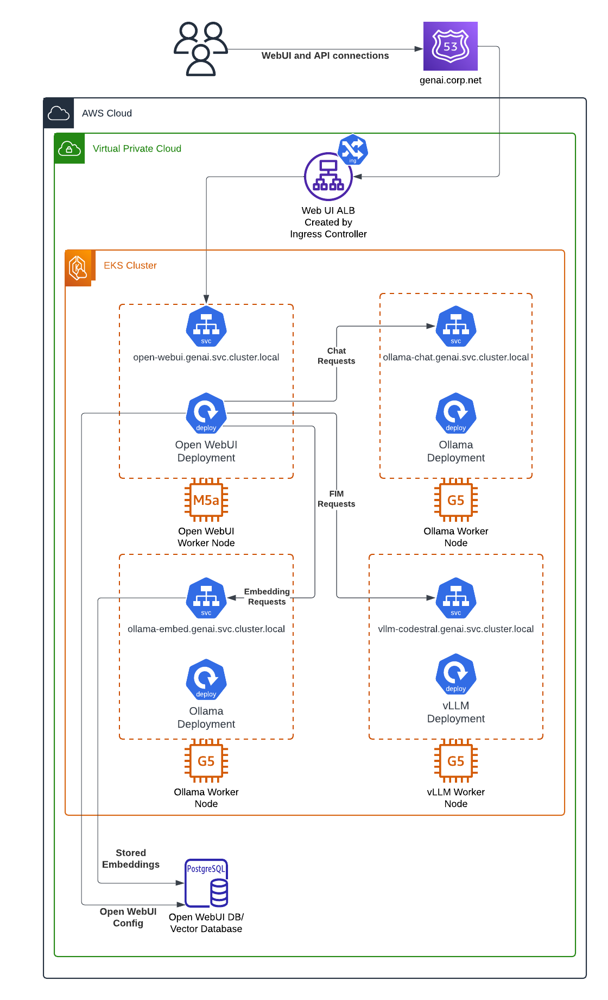

# Self Hosted Gen AI Quickstart in Amazon EKS
This repo uses Terraform and Helm to deploy Ollama and Open WebUI on Amazon EKS. This setup is very close to 
what I'm running in production today, and has been verified as a good working setup for a small team of 
developers to use for Ollama Chat and Ollama FIM capabilities. You can see the architecture built below:



## Requirements
This repo assumes you have all of the following:
1. An AWS account with a Public Hosted Zone in Route53. **This setup will not work without a Route53 domain**, 
as a cert is built in the domain you define to use on the WebUI URL for HTTPS. 
2. A basic understanding of how Terraform and Helm work, and Terraform installed on your machine.
3. A basic understanding of how Ollama and Open WebUI work.

## Costs
I am **NOT RESPONSIBLE** for any costs that you incur from choosing to build the 
resources in this quickstart. Be aware that the `g5.xlarge` instances used for this
quickstart cost $1 an hour in `us-west-2`, meaning that this setup can easily cost you **$50 a day**
if you leave it running! Be sure to destroy any resources you're not using to save on costs. 

## Security
This deployment is open to the whole internet by default. You can edit this by updating the security
group built from `aws_security_group.open-webui-ingress-sg`. 

# Getting Started
Start by cloning the repo.
`git clone https://github.com/0xthresh/self-hosted-genai && cd self-hosted-genai`


Open the `locals.tf` file for editing. Here, you can make edits to the environment based on your needs,
including changing the public hostname your instance will use, the models your Ollama backends will
pre-load, and other values. Each value is commented to explain what it will do. 

# Deployment
Once the locals in `locals.tf` are set to the desired values, you can initialize the Terraform code:
`terraform init`

Note that by default, this quickstart uses a local Terraform state file. You can change the state file
location in the `backend.tf` file if you want to use S3 or any other backend option. 

Once initialized, you can build the resources:
`terraform apply`

If your setup is correct, you should see the following:
```
Plan: 94 to add, 0 to change, 0 to destroy.

Do you want to perform these actions?
  Terraform will perform the actions described above.
  Only 'yes' will be accepted to approve.

  Enter a value: 
```
Type `yes` and hit Enter if you're ready to build it out. The apply usually takes 20-25 minutes. 
You may run into an error with the Ollama Helm charts; simply run `terraform apply` again, and
they should work on the second build attempt. 

You can now access your Open WebUI deployment by navigating to the FQDN, which uses your chosen
Route53 domain and your chosen record name (e.g., https://webui.0xthresh.xyz). Choose the Sign Up
option to create your firs Open WebUI admin user, and you can start testing!

# Cleaning Up
If you aren't planning on leaving this running long-term, make sure to destroy the resources in Terraform
to prevent yourself from paying a huge AWS bill. You can delete all resources by running:
`terraform destroy` 